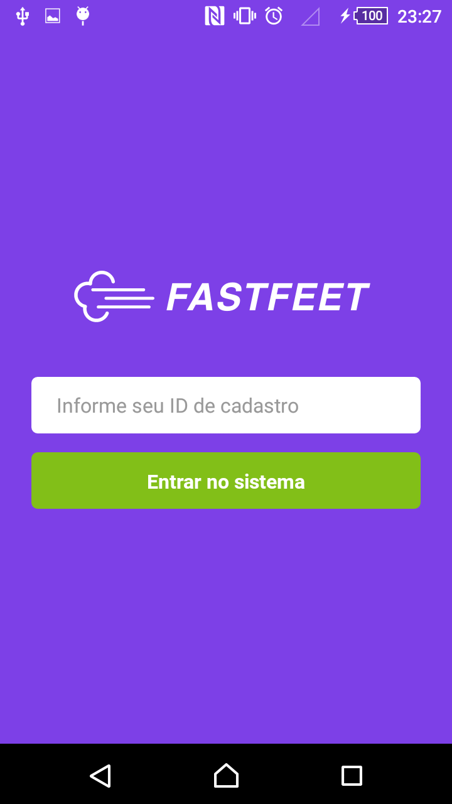
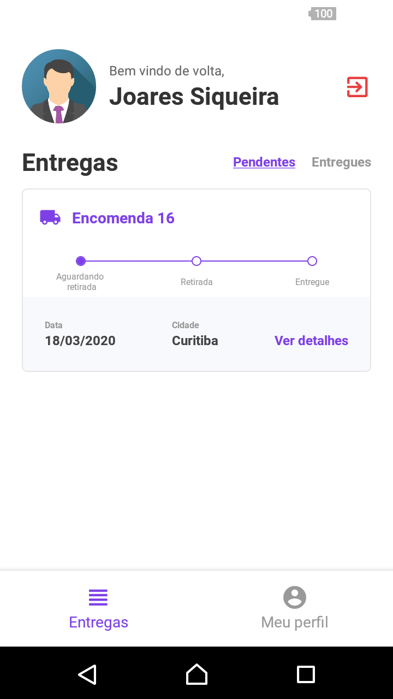
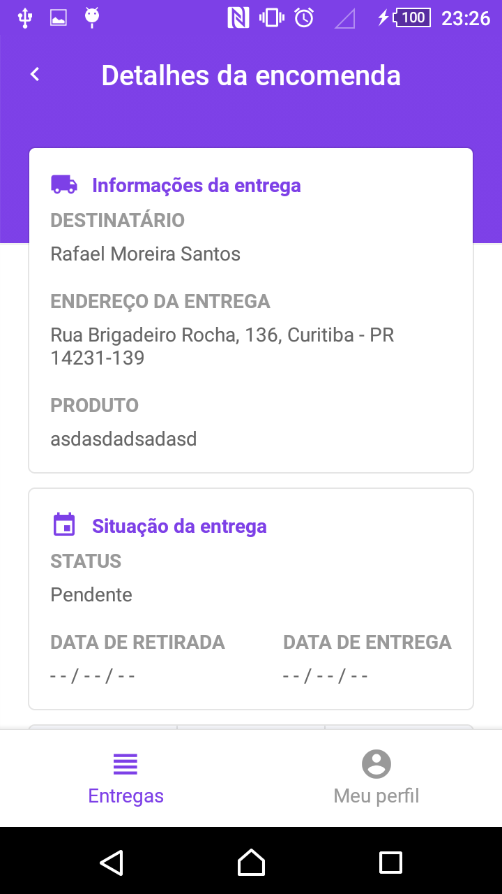
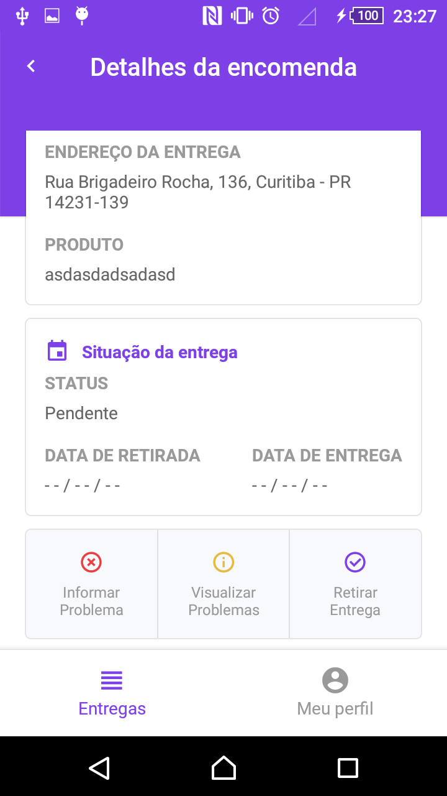
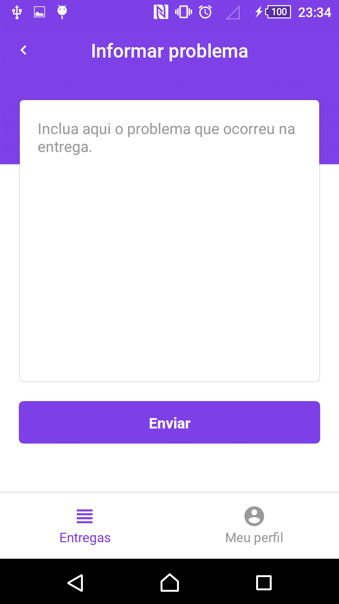
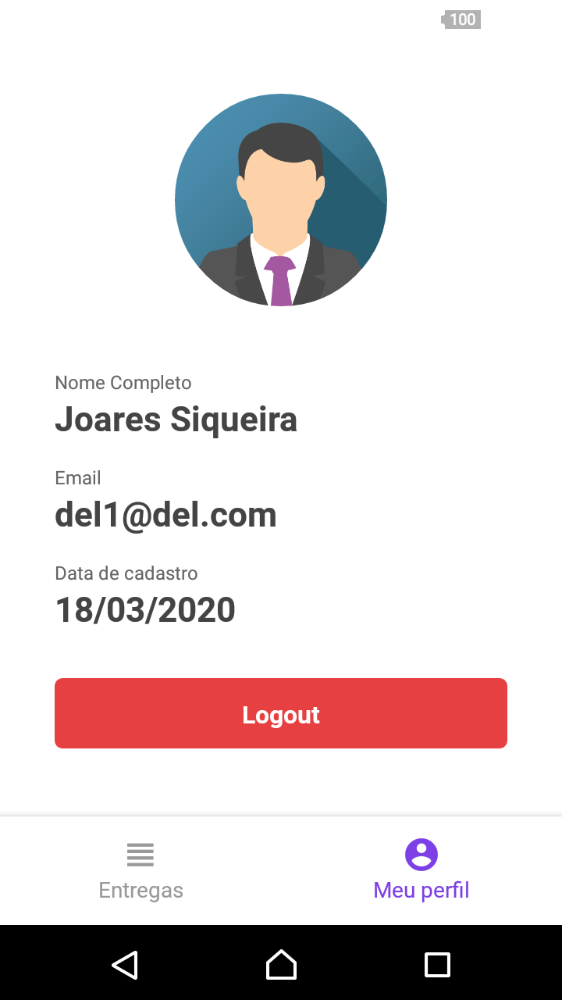

<h1 align="center">
    
</h1>

<h3 align="center">
  Código do desafio do 10° Módulo do Bootcamp - GoStack
</h3>

<blockquote align="center">“Sua única limitação é você mesmo”!</blockquote>

  <a href="#dart-sobre-o-desafio">Sobre o desafio</a>&nbsp;&nbsp;&nbsp;|&nbsp;&nbsp;&nbsp;
  <a href="#rocket-principais-tecnologias">Principais tecnologias</a>&nbsp;&nbsp;&nbsp;|&nbsp;&nbsp;&nbsp;
  <a href="#memo-license"> License </a>

## :dart: Sobre o desafio

O desafio do decimo módulo foi continuar com a aplicação da FastFeet, que é uma distribuidora fictícia, desta vez fazendo a parte mobile :iphone: :iphone:

  
  &nbsp;&nbsp;&nbsp;
  
  &nbsp;&nbsp;&nbsp;
  

&nbsp;&nbsp;&nbsp;

  
  &nbsp;&nbsp;&nbsp;
  
  

&nbsp;
Para dar uma olhada no back end do projeto :point_right: [Clique Aqui](https://github.com/maurodesouza/node-bootcamp-gostack-challenge-fastfeet) :point_left:

Para ver o projeto web :point_right: [Clique Aqui](https://github.com/maurodesouza/react-gostack-fastfeet) :point_left:

Na parte da web :computer: foram criadas as funcionalidades referentes ao administrador da distribuidora. Enquanto as funcionalidades dos entregadores dessa distribuidora foram feitas na parte mobile :iphone: :iphone:

##### As funcionalidades do entregador são: #####

- O entregador pode acessar a aplicação informando o seu id de cadastro;
&nbsp;
- Visualizar as encomendas - o entregador pode visualizar as encomendas atribuídas a ele, que não estejam entregues ou canceladas;
&nbsp;
- Alterar o status das encomendas - o entregador pode alterar o status incluindo uma data de retirada e uma data de entrega para as encomendas, sendo que:
  - O entregador só pode fazer 5 retiradas por dia;
  - Ao finalizar uma entrega, o entregador deve enviar uma imagem como assinatura;
&nbsp;
- Visualizar e cadastrar problemas nas entregas;

Para instalar e executar o projeto você precisa:

1. Fazer um clone do [back end](https://github.com/maurodesouza/node-gostack-fastfeet) e seguir os passos do `README` para rodar o servidor!
2. Fazer um clone desse repositório;
3. Entrar na pasta rodando `cd mobile-gostack-fastfeet`;
4. Rodar `yarn` para instalar as dependências;
5. Criar um arquivo `.env` da raiz do projeto e preencher as variáveis de acordo com o arquivo `.env.example`
6. Com o seu emulador conectado, rodar `yarn android` ou `yarn ios` para iniciar o projeto.

## :rocket: Principais tecnologias

- [React-native](https://reactnative.dev)
- [React-navigation](https://reactnavigation.org)
- [Styled-components](https://styled-components.com)
- [date-fns](https://date-fns.org)
- [Redux](https://redux.js.org)
- [Reactotron](https://github.com/infinitered/reactotron)

Para mais detalhes veja o [package.json](package.json)

## :memo: License

Esse projeto está sob licença MIT. Veja o arquivo [LICENSE](LICENSE.md) para mais detalhes.

---

Feito com :heart: by Mauro de Souza - Email: maurodesouza2017@hotmail.com
